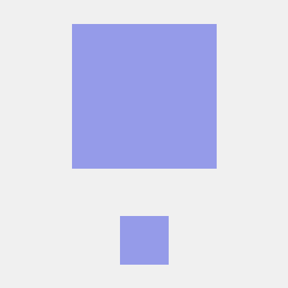

# 1. 프로젝트 소개 
<!-- image 추가 -->
## - motivation & introduction : 
  CNU SW ACADEMY 3기 6조의 프로젝트는 "ㅌㅌ"입니다.

  프로젝트의 주제를 고민했던 23년 8월에, 대한민국에는 묻지마 사건이 동시다발적으로 일어났었습니다.

  "ㅌㅌ"는 조금 더 안전한 사회를 만드는 데 기여하고자 하는 "위험 정보 알림 & 전파" 프로젝트입니다. 

# 2. 만든 사람들 

|||||||
|:--:|:--:|:--:|:--:|:--:|:--:|
|[아현](https://github.com/orgs/SWA3-6-ESCAPE/people/SongAhyeon01)|[봉우](https://github.com/bong-u)|[진호](https://github.com/JJH123123123)|[윤서](https://github.com/orgs/SWA3-6-ESCAPE/people/uu2727318)|[은주](https://github.com/orgs/SWA3-6-ESCAPE/people/mobile-eunju)|[장영](https://github.com/orgs/SWA3-6-ESCAPE/people/paintedblue)|
| 백엔드 | 백엔드 | 백엔드 | 모바일 | 모바일 | 모바일 |

# 3. 프로젝트 구조 && 기술 스택 

<!-- 이미지 ? -->

||

<ul>
  <li> Spring Boot </li>
  <li> Spring Data JPA </li>
  <li> Mockito </li>
  <li> MySQL </li>
  <li> Swift </li>
  <li> Nginx </li>
  <li> Oracle Cloud </li>
</ul>

# 4. Rules

### Commit Convetion
[Git - 커밋 메시지 컨벤션](https://doublesprogramming.tistory.com/256)

### Branch Merge 전략
[[GitHub]Branch 활용하여 협업하기 초급](https://www.saichoiblog.com/githubfork-branch/)
