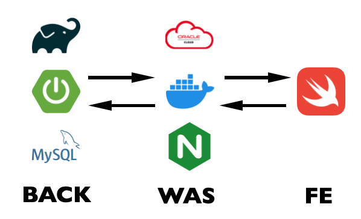

# 1 프로젝트 소개 

ㅌㅌ 

# 2. 만든 사람들 

||||||
|:--:|:--:|:--:|:--:|:--:|
|[아현](https://github.com/orgs/SWA3-6-ESCAPE/people/SongAhyeon01)|[봉우](https://github.com/bong-u)|[진호](https://github.com/JJH123123123)|[윤서](https://github.com/orgs/SWA3-6-ESCAPE/people/uu2727318)|[은주](https://github.com/orgs/SWA3-6-ESCAPE/people/mobile-eunju)|
| 백엔드 | 백엔드 | 백엔드 | 모바일 | 모바일 | 

# 3. 프로젝트 구조 

# 4.  기술 스택 

<!-- 이미지 ? -->

||

<ul
  <li> spring Boot </li>
  <li> spring Data JPA </li>
  <li> Mockito </li>
  <li> MySQL </li>
  <li> Swift </li>
  <li> Nginx </li>
  <li> heroku </li>
</ul>

# 5.  rule commite rule

### Commit Convetion
[Git - 커밋 메시지 컨벤션](https://doublesprogramming.tistory.com/256)

### Branch Merge 전략
[[GitHub]Branch 활용하여 협업하기 초급](https://www.saichoiblog.com/githubfork-branch/)
